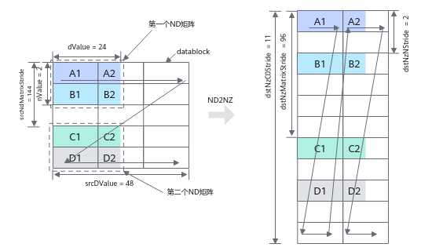

# Tiling 策略

## flash\_api\.cpp

### Q 的任务级划分

首先对 Q 做任务划分（qblock），其中包括 Q 的序列（S）维度和注意力头数（N）维度。

```C++
for (int32_t batchIdx = 0; batchIdx < batch_size; batchIdx++) {
        uint64_t qSeqlen = seqlen_q;
        if (is_varlen_q) {
            qSeqlen = *(cu_seqlen_q_cpu + batchIdx + 1) - *(cu_seqlen_q_cpu + batchIdx);
        }
        // 以下计算在代码中出现多次，都是用于计算 blockSize/Num
        uint64_t kvSeqlen = *(seqlens_k_cpu + batchIdx);
        uint64_t curQNBlockTile = GetQNBlockTile(qSeqlen, groupSize);
        uint64_t qNBlockNumPerGroup = (groupSize + curQNBlockTile - 1) / curQNBlockTile;
        uint64_t curQNBlockNum = qNBlockNumPerGroup * num_heads_k;
        uint64_t curQSBlockTile = GetQSBlockTile(kvSeqlen);
        uint64_t curQSBlockNum = (qSeqlen + curQSBlockTile - 1) / curQSBlockTile;
        uint64_t curTaskNum = curQNBlockNum * curQSBlockNum;
        if (batchIdx == 0) {
            tiling_cpu_ptr->set_firstBatchTaskNum(curTaskNum);
        }
        totalTaskNum += curTaskNum;
    }
```

- **GetQNBlockTile：对注意力头维度（N）**

    - **block 需要处理多少 Heads：** $blockSize=\frac{Q\_TILE\_CEIL}{S_q}$，其中 Q\_TILE\_CEIL 为 128；如果使用 GQA，还需要保证 blockSize 小于 groupSize（**保证一个 block 只处理一个 group 或一个 group 的部分 Q **），同时保证 blockSize 大于等于 1（至少处理一个 QHead）。根据公式可以得出$blockSize\in \left[1,groupSize\right]$，**如果不启用 GQA，qNBlockSize = 1**。

    - 根据测试脚本和 printf 语句打印 qNBlockSize，其一直都被计算成 1。

    - **需要多少 block**：

        - 如果有 GQA （即 qHeads / kHeads \> 1），由于 block 不能跨 group 做计算，因此先计算一个 Group 需要多少 block （**qNBlockNumPerGroup**），而 group 的数量就是 K 的注意力头数，故 N 维度总共需要 block 数量：**kHeads \* qNBlockNumPerGroup**。

        - 如果没有 GQA（qHeads == kHeads），groupSize 为 1，blockSize 就为 1，那么 blockNum 容易得出就是注意力头的数量：kHeads。

- **GetQSBlockTile：对序列维度（S**）

    - **block 需要处理多少 Token：**$tileSize=Q\_TILE\_CEIL=128$，目前的实现将 S 维度的 blockSize **硬编码**，和传入的参数无关。（自动优化？\) 

    - **需要多少 block**：序列维度直接做除法即可：$blockNum=\frac{S_q}{blockSize}$。

- **totalTaskNum：统计任务数量**

    - 遍历 BatchSize 的 N 和 S，得到的 N 和 S 块个数之积为任务数。

### K/V 的序列维度划分——FlashDecoding

函数 splitBN2S1GS2 （解释了 block 划分层级为：B， N， S1（S\_q）， S2（S\_kv） 中的** getBatchParams（不展开解释）**处理了 K/V 序列维度的任务划分，记录统计了每个 batch 的** QBlock（N，S）**和** KV 序列维度（S）**的划分规则。

```C++
void splitBN2S1GS2(FAInferTilingData* tiling, const SplitContext& ctx) {
    uint64_t totalTaskNum = 0;
    uint32_t groupSize = ctx.num_heads / ctx.num_heads_k;

    for (int32_t batchIdx = 0; batchIdx < ctx.batch_size; batchIdx++) {
        BatchParams p = getBatchParams(batchIdx, groupSize, ctx);
        totalTaskNum += static_cast<uint64_t>(ctx.num_heads) * p.qSeqlen * p.kvSeqlen;
    }
    // 通过上述估计的计算量，为每个AI Core平均分配任务
    uint64_t perCoreTaskNum = (totalTaskNum + ctx.blockDim - 1) / ctx.blockDim;
    fillCoreInfoForFlashDecode(tiling, groupSize, perCoreTaskNum, ctx);
    fillSplitInfoForFlashDecode(tiling, groupSize, ctx);
} 
```

- 先看 KV 的序列划分（getBatchParams 内调用的逻辑），遍历 BatchSize 维度用于记录各 batch 的 QN、QS、KS 划分策略，并估计所有 batch 合计的 Attention 计算量：**totalTaskNum **\+= qHeads \* S\_q \* S\_K（这里是估算负载，只统计了 QK^T 的计算量）。其中 KS 的划分策略如下：

```C++
uint32_t GetKSBlockTile(uint32_t kvSeqlen)
{
    uint32_t kSBlockTile = MAX_KV_STACK_LEN;
    return kSBlockTile;
}
p.curKSBlockTile = GetKSBlockTile(p.kvSeqlen);
p.curKSBlockNum = (p.kvSeqlen + p.curKSBlockTile - 1) / p.curKSBlockTile;
```

~~和 Q 的序列维度一样~~，这里 K/V **硬编码**成 **blockSize **= MAX\_KV\_STACK\_LEN = 512，因此 block 数量：**blockNum = **KSeqlen / blockSize。（优化？\) 

- **fillCoreInfoForFlashDecode**（**Core 级划分任务**）： 

为每个 Core 分配一个连续的 `(B, N1, S1, S2)` 区间，使得每个 Core 的计算量接近 `perCoreTaskNum`。

- 通过估计计算量，记录每个 Core 负责的（b\_idx， n\_idx， s1\_idx， s2\_idx）部分，如第一个 Core 可以负责（0， 0， 0， 9），代表负责前 9 个 KV Block。

- 先从最细粒度的 S2 划分：remainingQKV 为当前 batch 的当前块需要处理的 QKV 序列长度，与之前的 perCoreTaskNum 比较，得到 S2 级的任务划分个数：

```C++
// while (coreidx < coreNum)
while (nowS2Idx < static_cast<int32_t>(p.curKSBlockNum) && resTaskNum > 0) {
    p = getBatchParams(nowBIdx, groupSize, ctx);
    uint32_t remainingQ = (nowS1Idx < static_cast<int32_t>(p.curQSBlockNum) - 1)
        ? p.curQSBlockTile
        : (p.qSeqlen - nowS1Idx * p.curQSBlockTile) * p.curQNBlockTile;
    uint32_t remainingKV = (nowS2Idx < static_cast<int32_t>(p.curKSBlockNum) - 1)
        ? p.curKSBlockTile
        : (p.kvSeqlen - nowS2Idx * p.curKSBlockTile);
    uint64_t singleS2Task = static_cast<uint64_t>(remainingQ) * remainingKV;
    resTaskNum -= static_cast<int32_t>(singleS2Task);
    nowS2Idx += 1;
}

if (resTaskNum <= 0) {
    tiling->coreInfo[coreIdx].endBIdx = nowBIdx;
    tiling->coreInfo[coreIdx].endN1Idx = nowN1Idx;
    tiling->coreInfo[coreIdx].endS1Idx = nowS1Idx;
    tiling->coreInfo[coreIdx].endS2Idx = nowS2Idx;
}

advanceCounters();
if (nowBIdx < ctx.batch_size && resTaskNum <= 0) continue;
if (nowBIdx == ctx.batch_size) { finishBatch(coreIdx); break; }
```

- 如果当前 Core 完全可以消化当前 batch 的所有 S2 块（perTaskNum \> bacthTaskNum），则会尝试跳过整个 batch：

```C++
while (nowBIdx < ctx.batch_size && resTaskNum > 0) {
    p = getBatchParams(nowBIdx, groupSize, ctx);
    uint32_t remainingQ = p.qSeqlen * (ctx.num_heads - p.curQNBlockTile * nowN1Idx) - nowS1Idx * p.curQSBlockTile;
    uint32_t remainingKV = p.kvSeqlen;
    uint32_t remainingInBatch = remainingQ * remainingKV;

    if (resTaskNum >= static_cast<int32_t>(remainingInBatch)) {
        resTaskNum -= remainingInBatch;
        nowBIdx++; nowN1Idx = 0; nowS1Idx = 0; nowS2Idx = 0;
    } else {
        break;
    }
}

if (nowBIdx == ctx.batch_size) { finishBatch(coreIdx); break; }
```

- 其他维度的划分同理。

- **fillSplitInfoForFlashDecode**（记录上一步划分任务时的信息）

如果切分了 KV 的序列维度（S），每个 Core 在做 softmax 时无法获取全局最大值，只能得到 partial softmax result：

- fillCoreInfoForFlashDecode（） 已经完成了任务分配，每个 Core 都拿到了一段 `(B, N, S1, S2)` 范围。函数遍历这些 `coreInfo`，检查某个 `(B, N, S1)` 对应的全部 `S2(KV block)` 是否被多个 Core 分摊：

    - 如果一个 Core 覆盖了完整的 `S2` 范围，则该 Attention 独立完成，不需要额外处理。 

    - 如果多个 Core 分别负责同一个 `(B, N, S1)` 的不同 `S2` 区间，则发生了 `SplitKV`。 

此时函数生成一条 `splitInfo` 记录，标明这些 Partial Result 属于同一个 Attention。 后续计算阶段，各 Core 会把自己的 `partial_O`、`partial_LSE` 写入 Workspace。 Reduce Kernel 根据 `splitInfo` 找到这些 Partial Result。 最终完成跨 KV 分片的 Softmax 合并和 Output 合并，得到正确的 Attention 结果。

### 流水线中间值的内存分配

在 Device 级分配 4 个阶段**输出**（mm1， softmax， mm2， rescaleO）的内存：

```C++
// 单次注意力计算的最大 tile 面积 = Q_TILE_CEIL * MAX_KV_STACK_LEN
uint64_t WORKSPACE_BLOCK_SIZE_DB = 128 * 512; // (S_q, S_k)
uint64_t PRELANCH_NUM = 3;
uint64_t mm1OutSize = blockDim * WORKSPACE_BLOCK_SIZE_DB * 4 * PRELANCH_NUM;
uint64_t smOnlineOutSize = blockDim * WORKSPACE_BLOCK_SIZE_DB * 2 * PRELANCH_NUM;
uint64_t mm2OutSize = blockDim * WORKSPACE_BLOCK_SIZE_DB * 4 * PRELANCH_NUM;
uint64_t UpdateSize = blockDim * WORKSPACE_BLOCK_SIZE_DB * 4 * PRELANCH_NUM;
// 上文提到的 FlashDecoding 的 SplitInfo
uint64_t splitLseTotalSize = tiling_cpu_ptr->get_splitLseTotalSize();
uint64_t splitOTotalSize = tiling_cpu_ptr->get_splitOTotalSize();
int64_t workSpaceSize = static_cast<int64_t>(mm1OutSize + smOnlineOutSize + mm2OutSize
        + UpdateSize + splitLseTotalSize + splitOTotalSize);
```

- 注意到每个 Size 都乘上 2 或 4 （element per byte），这是因为：

- PRELAUNCH\_NUM = 3：流水线机制 （QK^T \-\> SM） 需要三重 buffer 保护同一份数据不被修改，故乘 3。

- blockDim：aicore 的数量，为每个核都分配临时空间用于存放中间值。

## mha\_fwd\_kvcache\.cpp

本项目有定义 **L1\_MAX\_SIZE **为 **523288=512KB**，**L1\_MAX\_N\_NUM **为  **128**。 

### Matmul 算子任务划分

按照\<M， N， K\>，如 QK^T：**M** = Q 的行数（`qSBlockSize × qNBlockSize` 个 token\-head 对）；**N** = KV tokens 数（S2 维度）；**K** = hidden\_dimension （D）（`embed`），两个 Matmul 算子的 **L1/L0 搬运规则**如下：

```Java
// QK matmul: S = Q [M,K] × K^T [K,N]
using L1TileShapeQK = GemmShape<128, 128, 128>;  // <M, N, K>
using L0TileShapeQK = GemmShape<128, 128, 128>;

// PV matmul: O_tmp = P [M,K] × V [K,N]  
using L1TileShapePV = GemmShape<128, 128, **256**>;  // <M, N, K>
using L0TileShapePV = GemmShape<128, 128, 128>;
```

- 其中 PV 的 L1 搬运数量在 K 维度较大，可能是因为 V 的搬运没有 double buffer，需要一次装更多来摊薄开销？

已知 L0/L1 搬运最低要对齐 128，对于 V 还要考虑扩大到 256。在代码中，KV 通过在外部遍历 N 维减少了 L1 占用空间，**KV 在 L1 只存 （S， D）**，按照这个标准初始化 Matmul\_QK/PV 算子：

```C++
// 对齐到 128 提升搬运效率，如果低于 256 ( V 的最低)，设置为 256
// kDynNum: dimension K + Dynamic + Num
uint32_t kDynNum = RoundUp(embed, NUM_128);
kDynNum = kDynNum < NUM_256 ? NUM_256 : kDynNum;

// 从 L1 总容量减去 V 的常驻空间
uint32_t maxQKPL1Size = L1_MAX_SIZE - embedV * MAX_KV_STACK_LEN * sizeof(ElementV);
// Q 同理
uint32_t maxQL1Size = Q_TILE_CEIL * kDynNum * sizeof(ElementQ);
// 剩余给 K 双缓冲的容量 → 计算 N轴（S_k序列长度维度）能装多少
uint32_t maxNDynNum =
    ((maxQKPL1Size - maxQL1Size) / kDynNum / sizeof(ElementV) / DOUBLE_BUFFER) / NUM_32 * NUM_32;
// 但不能超过硬件上限
uint32_t nDynNum = maxNDynNum < L1_MAX_N_NUM ? maxNDynNum : L1_MAX_N_NUM;
// ~~DataCopy 要求输入对齐 32 字节，这里对齐~~
nDynNum = L1_MAX_N_NUM % nDynNum != 0 ? RoundDown((nDynNum - 1), NUM_32) : nDynNum;

uint32_t L1_QK_SIZE = BlockMmadQK::L1TileShape::M * kDynNum * sizeof(ElementQ);
blockMmadQK.init(resource, nDynNum, kDynNum, MAX_KV_STACK_LEN);

// P 复用 K 的 buffer 位置, 用于确定 V 的空间占比
// 由于 PSize=nDynNum * kDynNum, 所以 PV 的内积维度(S_kv)再除以 L1Tile::M
// 故在 PVMatmul中 V 形状为：(L1Tile::M, kPVDynNum)
uint32_t kPVDynNum = nDynNum * kDynNum / BlockMmadPV::L1TileShape::M;
blockMmadPV.init(resource, nDynNum, kPVDynNum, MAX_KV_STACK_LEN, L1_QK_SIZE);
```

- QK 和 PV 共用 L1，为了复用，初始化、执行的策略不同：

    - **`blockMmadQK.init(resource, nDynNum, kDynNum, 512)`**

        - 在 L1 和 L0 中分配缓冲区，QK Matmul 执行时：

            - **Q → L1**：在 KV 循环外一次装载，跨所有 KV tile 重用

            - **K → L1**：每迭代装载当前 KV tile 对应的 K 片段，双缓冲交替（`l1KvPingPongFlag` 乒乓）

            - **L1 → L0**：每迭代将 Q 和 K 的 sub\-tile 搬运到 L0A/L0B，Cube 计算 S=Q×K^T→L0C→GM

    - **`blockMmadPV.init(resource, nDynNum, kPVDynNum, 512, L1_QK_SIZE)`**

        - **P → L1**：从 GM（Softmax 输出）装载当前 KV tile 对应的 P 片段，双缓冲

        - **V → L1**：从 GM 装载 V 片段，单缓冲（无乒乓），因为 V 是 ColumnMajor 布局且体积大

        - **L1 → L0**：Cube 计算 O\_tmp=P×V→L0C→GM

### 四阶段流水线入口的任务划分

根据之前介绍的 [FlashDecoding](https://nwyowzct1sk.feishu.cn/wiki/FO1QwI9ohi52TRkiHrUcdJM8nMb?table=tbl8FrdrMHRqt4PQ&view=vew43d1CCs#share-TlI6d5UUDofZqrxmVQCcCAEonVg)：

- 如果启用 FlashDecoding，每个核则通过前述获得的 SplitInfo 中其负责的 （B， N， S1， S2） 索引，计算部分 softmax 结果。每个核实际上负责 （B， N， S1） 子块，S2 的遍历在 runMainLoop 中：

    ```C++
    /*
    for (B)
        for (N)
            for (S1):
    */
    runMainLoop(
        coreIdx, **BIdx**, (uint32_t)**n1Idx**, (uint32_t)**s1Idx**,
        isSplitKV, **stS2IdxNow, enS2IdxNow**,
        gmOffsetLseFD, gmOffsetOFD,
        globalTensors
    );
    // 当前 Core 是否只能完成 Batch 内的部分 KV 序列
    bool isSplitKV = (enS2IdxNow - stS2IdxNow) > 0 &&
                                    (enS2IdxNow - stS2IdxNow) < static_cast<int32_t>(curKSBlockNumTmp);
    if (isSplitKV) {
        // 当前 (B, N1, S1) Block 内的 S1 分片大小
        uint32_t qSBlockSizeTmp = (s1Idx == static_cast<int32_t>(curQSBlockNumTmp - 1U)) ?
            (qSeqlenCur - s1Idx * curQSBlockTileTmp) : curQSBlockTileTmp;
        // n1Idx 是全局 N(Head)索引，qNBlockNumPerGroupTmp 是每个 group 内 tile 的数量
        // 如此取模操作可以得到当前 tile 在 group 内的索引
        uint32_t qNBlockIdxCurGroupTmp = n1Idx % qNBlockNumPerGroupTmp;
        // 与之前的 Q 序列长度等类似，取要处理的 N 长度
        uint32_t qNBlockSizeTmp = (qNBlockIdxCurGroupTmp == (qNBlockNumPerGroupTmp - 1U)) ?
            (groupSize - qNBlockIdxCurGroupTmp * curQNBlockTileTmp) : curQNBlockTileTmp;
        gmOffsetLseFD += qSBlockSizeTmp * qNBlockSizeTmp;
        gmOffsetOFD += qSBlockSizeTmp * qNBlockSizeTmp * embedV;
    }
    Workspace 布局（FD 区域）：**(S * N)**
    ┌─────────────────────────────────────────────────────────────┐
    │ gLseFD (splitLseTotalSize 字节)                            │
    │  ┌──────────┬──────────┬──────────┬──────────┐           │
    │  │ Split 0  │ Split 1  │ Split 2  │ Split 3  │ ...       │
    │  │ LSE      │ LSE      │ LSE      │ LSE      │           │
    │  └──────────┴──────────┴──────────┴──────────┘           │
    ├─────────────────────────────────────────────────────────────┤
    │ gOFD (splitOTotalSize 字节): **(S * N * D)**                 │
    │  ┌──────────┬──────────┬──────────┬──────────┐           │
    │  │ Split 0  │ Split 1  │ Split 2  │ Split 3  │ ...       │
    │  │ O        │ O        │ O        │ O        │           │
    │  └──────────┴──────────┴──────────┴──────────┘           │
    └─────────────────────────────────────────────────────────────┘
    ```

    当前 （n1， s1） tile 的完整 KV 序列被拆分给多个 Core，每个核只处理一段子区间 `[kvStart, kvEnd)`。而如果当前 Core 处理的不是整个 batch 的 KV 序列，此时就要将部分和输出写到 workspace 中的 FD slot（临时 GM buffer，fp32 精度），每写一个 tile 把指针推到下一个 tile 的 slot 位置。多个核处理同一个 （n1，s1） 的不同 K\-slice，各自写各自的 FD slot（因为 `firstSplitKVTaskLseOffset` 不同），最后在后续的 combine epilogue 中汇总归一化。

    ```C++
    if constexpr (IS_FD) {
        AscendC::SyncAll();
    #ifdef __DAV_C220_VEC__
        CombineScale combineScale;
        combineScale.init(resource);
        combineScale(qHeads,fATilingData->totalSplitNodeNum,embedV,
            fATilingData->splitInfo,gLseFD,gOFD,gO,gActualQseqlen,
            true,(LSE_MODE == Epilogue::LseModeT::OUT_ONLY),gLse
        );
    ```

- 如果不启用 FlashDecoding，[直接按照 Task 遍历](https://nwyowzct1sk.feishu.cn/wiki/FO1QwI9ohi52TRkiHrUcdJM8nMb?table=tbl8FrdrMHRqt4PQ&view=vew43d1CCs#share-KmU6dde5mo6pD8x8K5bcgiIvn8f)，即 （Task， S2）。根据之前组装 Task 的顺序，逆序拆解出 B， N， S 参数进 runMainLoop 进行计算：

    - **分配方式**：每个 Core 从自己的 `coreIdx` 开始，每隔 `coreNum` 取一个任务（`taskIdx = coreIdx + n * coreNum`）（**Round\-Robin 轮询策略**）。

    - **任务定位**：通过累加每个 Batch 的任务数（`curTotalTaskNumTmp`），定位 `taskIdx` 属于哪个 Batch，再通过除法和取模得到 `(N, S1)` 坐标，因此得到确定的 `(B, N, S1)`。

    - **执行**：每个任务都是完整的（`isSplitKV = false`），即一个 Core 负责一个 `(B, N, S1)` 的全部 KV 序列，结果直接写回 Global Memory，无需 `CombineScale` 归约。

### 四阶段流水线（runMainLoop）

该步骤接收 （B， N， S1） 任务作为输入，内部再遍历 S2 维度（KV Seqlen），依次执行四阶段流水操作。

#### QKVO 等 索引计算

- BatchOffset：当前 batch 的起始地址

    - 以 Q 的索引计算为例，预计算的多个步长（如 strideQ ）含义为：BSND 的 B 维度每增加 1 对应的索引变换（ \+= S \* N\*D），因此 Q 当前 batch 的 qBOffset 应该为当前 S \* strideQ：

    ```C++
    strideQ = static_cast<uint64_t>(qHeads * embed);
    strideO = static_cast<uint64_t>(qHeads * embedV);
    strideK = static_cast<uint64_t>(kvHeads * embed);
    strideV = static_cast<uint64_t>(kvHeads * embedV);
    
    uint64_t qBOffset = static_cast<uint64_t>(prevQSeqlenSum) * strideQ;
    ```

    - 而 KV 不一定是连续排布的，如果启用 Paged KV Cache，KV 会被组织成 **block Table**，因此 KBOffset 应该使用页表的数据计算：

    ```C++
    blockBOffset = static_cast<uint64_t>(BIdx) * static_cast<uint64_t>(maxNumBlocksPerBatch);
    ```

- gmOffset：当前 block（B， N， S1） 对应 GM 的起始地址

    - **Q** 整块加载到 L1 Buffer，然后被所有 S2 迭代复用，但一个 `(B, N1, S1)` 任务只加载 Q 的一个 S1 分片，所以需要在 S 维度上定位到正确的 S1 块，故索引直接计算 S1 的索引。

    ```C++
    // 和之前同样的**重复计算**，只是为了得到 S、N 方向的分块大小，用于计算出 GQA 下 Q 的 N 索引位置等等
    uint32_t curQNBlockTile = GetQNBlockTile(qSeqlen, groupSize);
    uint32_t qNBlockNumPerGroup = CeilDiv(groupSize, curQNBlockTile);
    uint32_t curQSBlockTile = GetQSBlockTile(kvSeqlen);
    uint32_t curQSBlockNum = CeilDiv(qSeqlen, curQSBlockTile);
    uint32_t curKSBlockNum = CeilDiv(kvSeqlen, MAX_KV_STACK_LEN);
    
    uint32_t qNBlockIdxCurGroup = qNBlockIdx % qNBlockNumPerGroup;
    uint32_t kvNIdx = qNBlockIdx / qNBlockNumPerGroup;
    uint32_t qNStartIdx = kvNIdx * groupSize + qNBlockIdxCurGroup * curQNBlockTile;
    uint32_t lseTokenOffset = qSBlockIdx * curQSBlockTile * qHeads;
    
    // BOffset + S * stride + N * D
    uint64_t gmOffsetQ = qBOffset +
    static_cast<uint64_t>(qSBlockIdx * curQSBlockTile) * strideQ +
    static_cast<uint64_t>(qNStartIdx * embed);
    ```

    - **KV** 为流式加载，在后续循环中迭代 S2，动态指定 S2 块的偏移，故 KV 的索引只计算到 N 的偏移：

    ```C++
    // BOffset + N * D
    uint64_t gmOffsetK = kBOffset + static_cast<uint64_t>(kvNIdx * embed);
    uint64_t gmOffsetV = vBOffset + static_cast<uint64_t>(kvNIdx * embedV);
    ```

    - **S **为 QK 计算的中间值，属于临时变量，[回想之前的内容](https://nwyowzct1sk.feishu.cn/wiki/FO1QwI9ohi52TRkiHrUcdJM8nMb?table=tbl8FrdrMHRqt4PQ&view=vew43d1CCs#share-PNY8dBLRFohJCyxUGrBcOnrDnSh)，利用这片区域存储：

    ```C++
    // (aicore 索引 * workspaceSize * 流水需要的buffer级) + 
    uint64_t gmOffsetS =static_cast<uint64_t>
    (coreIdx * WORKSPACE_BLOCK_SIZE_DB * (PRE_LAUNCH + 1U)
        + curStackTileMod * WORKSPACE_BLOCK_SIZE_DB);
    // 比如：第 2 个核的第二个buffer：coreidx=1, curStackTileMod = 1 % 3 = 1
    Core 0: ┌───┬───┬───┐
            │ 0 │ 1 │ 2 │
            └───┴───┴───┘
    Core 1: ┌───┬───┬───┐
            │ 0 │(1)│ 2 │
            └───┴───┴───┘
    Core 2: ┌───┬───┬───┐
            │ 0 │ 1 │ 2 │
            └───┴───┴───┘
    ```


#### S2 块的遍历

按照流水线，先做 QK 和 SM，preKVNum 个周期后做 PV 和 RescaleO。我们先关注 preKVNum 预取周期内做的事情：

- 因果注意力时，计算遍历 KV 的次数：

noSkipKvS 代表本次 Q 块遍历 KV 时能看到的最大 KV 长度，从此处开始的历史 KV 不会被 mask；diffS 代表 KV 与 Q 序列长度的差值，用于把当前 Q 块对齐 KV 的最右端。

- 比如在 LLM decode 阶段，kSeqlen \>\> qSeqlen，生成第一个 token 时，Q 块索引为 0，但其能看到 0 \+ diffS 的历史 KV 序列。

```C++
qSeqlen     diffS
Q: |--------------|-----|
K: |--------------------|
            kSeqlen  <-start
uint32_t noSkipKvS = kvSeqlen;
if (maskType != 0U) {
    int64_t diffS = kvSeqlen - qSeqlen;
    diffS = (diffS < 0) ? 0 : diffS;
    noSkipKvS = (qSBlockIdx + 1U) * curQSBlockTile + diffS;
    noSkipKvS = AscendC::Std::min((uint32_t)kvSeqlen, noSkipKvS);
}
// [对齐之前提及到的单次注意力最大 K 切片大小：MAX_KV_STACK_LEN](https://nwyowzct1sk.feishu.cn/wiki/FO1QwI9ohi52TRkiHrUcdJM8nMb?table=tbl8FrdrMHRqt4PQ&view=vew43d1CCs#share-GNzZdDMWzou55zxBUAiccPIInid)
// [也对应 FlashDecoding 中对 K 的序列划分大小](https://nwyowzct1sk.feishu.cn/wiki/FO1QwI9ohi52TRkiHrUcdJM8nMb?table=tbl8FrdrMHRqt4PQ&view=vew43d1CCs#share-JjYEdeT1ZoMSnwxjIWFcxXIjnfs)
// 获取 S2 遍历空间的上界
uint32_t kvSLoopNumTotal = CeilDiv(noSkipKvS, MAX_KV_STACK_LEN);
uint32_t kvStart = 0;
uint32_t kvEnd = kvSLoopNumTotal;
```

当然，如果启用 FlashDecoding，遍历索引：kvStart 和 kvEnd 需要调整为 splitInfo 的索引：

```C++
if constexpr (IS_FD) {
    // 传入的当前Core负责的起始位置和初始位置
    kvStart = (uint32_t)stS2IdxNow;
    // 最后一块做尾块处理
    kvEnd = (enS2IdxNow == static_cast<int32_t>(curKSBlockNum)) ?
        kvSLoopNumTotal : (uint32_t)enS2IdxNow;
}
```

##### QK^T Matmul \(qk\_matmul\.hpp\)


###### Q 的 L1 搬入

首先定义 Catlass 的 Layout 层用于实现 GM \-\> L1 搬运，注意这里的 DataCopy 搬运规则用的是[随路转换 ND2NZ 搬运](https://www.hiascend.com/document/detail/zh/CANNCommunityEdition/850/API/ascendcopapi/atlasascendc_api_07_00127.html)，所以 L1 内存储的 Q 已经为 NZ 格式。



```C++
int32_t stackSeqCount = 0;
uint32_t preKVNum = PRE_LAUNCH;    // 预取 KV 的轮数，用于流水
uint32_t blockStackNum = (MAX_KV_STACK_LEN - 1 + pagedBlockSize) / pagedBlockSize;
uint32_t stackSeqTile = MAX_KV_STACK_LEN;    // KV 单块的 S 维长度 （依旧无意义重命名？）
uint32_t stackSeqTilePad = MAX_KV_STACK_LEN;

// rowNum = qSBlockSize * qNBlockSize (S * N)
// 用于将单/多个 Q 与单个 K 做计算：
// 如果启用GQA，同个 group 内的多个 Q 共享一个 K Head
// 否则 qNBlockSize=1，rowNum = qSBlockSize(一个Q)
LayoutQ layoutQTemp(rowNum, embed);    // (S * N * D)
// strideK = kHeads * D (N * D)
LayoutK layoutKTemp(strideK, stackSeqTile);    // (N * D * S)
```

**在遍历 KV 前将整个 Q 搬运到 L1。**

- **GM \-\> L1**：设计两个 layout：

    - layoutSingleANd：src（GM），一次搬运 **\[**singleGroupHeads（qNBlockSize \-\> N，当前 S1 块最大 N 容量）， embed（D）**\]**，通过指定重复搬运 tokenNumPerGroup（S 维） 次减少指令发送数、避免 datacopy 一次搬不了太多数据。

    - layoutAInL1：dst（L1），总共接收 **\[**rowNum（qNBlockSize\*qSBlockSize \-\> N\*S）， embed（D）**\]**。

- **分形**：NZ 分形以 C0×C0（[BLOCK\_SIZE](https://www.hiascend.com/document/detail/zh/CANNCommunityEdition/850/API/ascendcopapi/atlasascendc_api_07_0249.html)）=16×16 为基本块重组，按前述的 L1 TileShape 来讲，原 ND 分形 Q 的 embed（D） 大小应该是 128，那么就能分出 8 个 C0 块；

- GM 到 L1 的搬运使用 double Buffer。

```C++
blockMmadQK.loadQGM(gQ[gmOffsetQ], layoutQTemp, rowNum, qNBlockSize, qHeads);
 __aicore__ inline void loadQGM(
    AscendC::GlobalTensor<ElementA> gA, LayoutA layoutA,
    uint32_t rowNum, uint32_t &singleGroupHeads, uint32_t &qHeads)
{
    uint32_t embed = layoutA.shape(1);
    uint32_t rowNumRound = RoundUp(rowNum, L1AAlignHelper::M_ALIGNED);    // L1 NZ 对齐
    uint32_t tokenNumPerGroup = rowNum / singleGroupHeads;
    auto layoutSingleANd = layoutA.GetTileLayout(MakeCoord(singleGroupHeads, embed));
    LayoutAInL1 layoutAInL1 = LayoutAInL1::template MakeLayout<ElementA>(rowNum, embed);
    copyGmToL1A(l1ATensor, gA,    // dst, src
                layoutAInL1, layoutSingleANd,    //dst, src layout
                tokenNumPerGroup, qHeads * embed, tokenNumPerGroup, BLOCK_SIZE, rowNumRound);
}
```

经过搬运，整块 Q（rowNum， D） 被搬入 L1，其中 rowNum = S\_q \* N。

###### K 的 L1 搬入

**K 和 Q 不同，每次只搬运小部分，通过使用当前 N 索引，在外部重计算 gmOffsetK 获取 当前 K 块（S2 块）索引，因此 K 在 L1 中的大致形状为：（D， S），没有 N。**[由上述可知](https://nwyowzct1sk.feishu.cn/wiki/FO1QwI9ohi52TRkiHrUcdJM8nMb?table=tbl8FrdrMHRqt4PQ&view=vew43d1CCs#share-JvGhdwoPxo1JN9xScnlcEBjin8d)，KV 只计算了 N 的偏移，在遍历 KV（S2） 过程中，通过将 S2 索引传入 QK 算子来添加 S 维度的偏移，实现搬运：

```C++
// 循环外只计算到 N 偏移
uint64_t gmOffsetK = kBOffset + static_cast<uint64_t>(kvNIdx * embed);
// 循环内通过 kvSIdx 和 pagedBlockTable 决定从 GM 的哪个位置取 K
blockMmadQK(..., kvSIdx, kvSLoopNumTotal, pagedBlockSize, strideK);
```

- 若不启用 Paged\_KV，KV 是连续排布的，使用尾块策略，用之前 L1 Tile Shape 用到的 nDyNum 初始化矩阵乘中 N 轴搬运的数值（getBlockShape）；由于调用 QKMatmul 算子时传入的 K 已经调整了 BN 的偏移，因此只需要在此基础上加上序列维度的偏移。

    ```C++
    getBlockShape(**actualShape**, nL1Idx, nL1Loop, stackSeqTile);
    getKVOffset(gBOffset, nIdx, nL1Idx, strideKV);
    /*
    __aicore__ inline
    void getKVOffset(uint32_t &kOffset, uint32_t nIdx, uint32_t nowNIdx, uint32_t strideKV)
    {
        kOffset = nIdx * maxKVStackLen * strideKV + nowNIdx * l1NDynamic * strideKV;
    }
    */
    mActual = actualShape.m();
    kActual = actualShape.k();
    nActual = actualShape.n();
    // K L1 Tile layout
    layoutBInL1 = LayoutBInL1::template MakeLayout<ElementB>(kActual, nActual);
    // 从外部的 K Block Layout 中裁剪 L1 Tile搬运的最小单元
    // (strideK(NxD), S) -> (embed(D), L1Tile::S)
    auto layoutBTile = layoutB.GetTileLayout(MakeCoord(kActual, nActual));
    AscendC::WaitFlag<AscendC::HardEvent::MTE1_MTE2>(l1KvPingPongFlag);
    // 应该没有涉及分形？没有看到关于分形转换的函参
    copyGmToL1B(l1BTensor[l1KvPingPongFlag], gB[gBOffset], layoutBInL1, layoutBTile);
    AscendC::SetFlag<AscendC::HardEvent::MTE2_MTE1>(l1KvPingPongFlag);
    ```

- 若启用 Paged\_KV\_Cache：

\.\.\.\.\.\.待完善

- GM 到 L1 的搬运使用 double Buffer。

经过以上搬运，当前 S2 块的 K **（D， S\_k）** 被搬入 L1。

###### 计算 QK^T 的 L0 tile 切分

`BlockMmad` 并不一次性做整个 `{rowNum, S_k, D}` 的矩阵乘，而是将 Q、K 划分成一个个 **L0 tile\<128， 128， 128\>**。

- L1 \-\> L0：搬运使用 double Buffer。

- L0 的 layout 使用先前定义的 L0 TileShape：128，尾块则只取剩余部分。

    - 计算过程如下：

    ```C++
    uint32_t mL0Actual = (mL0Idx < mL0Loop - 1U) ? L0TileShape::M : (mActual - mL0Idx * L0TileShape::M);
    uint32_t kL0Actual = (kL0Idx < kL0Loop - 1U) ? L0TileShape::K : (kActual - kL0Idx * L0TileShape::K);
    LayoutAInL0 layoutAInL0 = LayoutAInL0::template MakeLayout<ElementA>(mL0Actual, kL0Actual);
    // 举个例子，Q 从 L1 到 L0：
    // L1[offset], offset = L1Layout.GetOffset(coord), coord = M * mIdx + K * kIdx (从 L1 截取的部分)
    MatrixCoord l1ATileCoord{mL0Idx * L0TileShape::M, kL0Idx * L0TileShape::K};
    auto l1ATile = l1ATensor[layoutAInL1.GetOffset(l1ATileCoord)];
    
    bool initMmad = (kL0Idx == 0U);
    uint32_t mL0Align = (mL0Actual + BLOCK_SIZE - 1U) / BLOCK_SIZE * BLOCK_SIZE;    // 对齐 16
    tileMmad(l0CTensor[l0CPingPongFlag], l0ATensor[l0ABPingPongFlag],
             l0BTensor[l0ABPingPongFlag], mL0Align, nActual, kL0Actual, initMmad);
    ```

    - 从下方文档可以看出，AscendC 的 Mmad 接口希望 ABC 矩阵都对齐到 16，但代码只传了 m0 的对齐？


    - **910B4**，C 矩阵搬回 GM：

    结果矩阵 C 从 L0 tile 按照 L0 的 M， N 索引搬运到 GM：

    ```C++
    // LayoutC: (rowNum, S_k, S_k)
    LayoutS layOutS(rowNum, stackSeqTile, stackSeqTilePad);
    
    MatrixCoord gmCTileCoord{mL0Idx * L0TileShape::M, nL1Idx * l1NDynamic};
    LayoutC layoutCTile = layoutC.GetTileLayout(MakeCoord(mL0Actual, nActual));
    auto layoutInL0C = LayoutCInL0::MakeLayoutInL0C(MakeCoord(mL0Actual, nActual));
    copyL0CToGm(gC[layoutC.GetOffset(gmCTileCoord)], l0CTensor[l0CPingPongFlag], layoutCTile, layoutInL0C);
    ```

##### OnlineSoftmax \(online\_softmax\.hpp\)

###### UB 分析

预定义 BLOCK\_SIZE：

```C++
UB_UINT8_BLOCK_SIZE  = 16384 = 16KB
UB_UINT8_VECTOR_SIZE = 1024 = 1KB
```

|前缀|含义|后缀|含义|
|---|---|---|---|
|`l`|Local （当前 tile）|`s`|Score （分数 S）|
|`h`|History （历史累积）|`p`|Probability （概率 P， softmax（S））|
|`g`|Global （全局）|`m`|Max （最大值）|
|`d`|Delta （校正因子）|`l`|Sum （求和）|
|`t`|Temporary （临时）|`v`|Vector （向量）|

```C++
__aicore__ inline
void init(Arch::Resource<ArchTag> &resource, float scaleValue_)
{
    // Allocate UB space
    constexpr uint32_t LS_UB_TENSOR_OFFSET = 0;    // 占 4*16 = 64KB，下列计算同理
    
    // 最终输出 LP，中间掩码 MASK，MASK32 共用一个存储区域，占 96KB
    constexpr uint32_t LP_UB_TENSOR_OFFSET = 4 * UB_UINT8_BLOCK_SIZE;
    constexpr uint32_t MASK_UB_TENSOR_OFFSET = 4 * UB_UINT8_BLOCK_SIZE;
    constexpr uint32_t MASK32_UB_TENSOR_OFFSET = 4 * UB_UINT8_BLOCK_SIZE;
    // 以下每个占 UB_UINT8_VECTOR_SIZE= 1KB 大小
    constexpr uint32_t TV_UB_TENSOR_OFFSET = 10 * UB_UINT8_BLOCK_SIZE;
    constexpr uint32_t LM_UB_TENSOR_OFFSET = 10 * UB_UINT8_BLOCK_SIZE + 8 * UB_UINT8_VECTOR_SIZE;
    constexpr uint32_t HM_UB_TENSOR_OFFSET = 10 * UB_UINT8_BLOCK_SIZE + 9 * UB_UINT8_VECTOR_SIZE;
    constexpr uint32_t GM_UB_TENSOR_OFFSET = 10 * UB_UINT8_BLOCK_SIZE + 10 * UB_UINT8_VECTOR_SIZE;
    constexpr uint32_t LL_UB_TENSOR_OFFSET = 10 * UB_UINT8_BLOCK_SIZE + 11 * UB_UINT8_VECTOR_SIZE;
    constexpr uint32_t GL_UB_TENSOR_OFFSET = 10 * UB_UINT8_BLOCK_SIZE + 12 * UB_UINT8_VECTOR_SIZE;
    constexpr uint32_t DM_UB_TENSOR_OFFSET = 10 * UB_UINT8_BLOCK_SIZE + 13 * UB_UINT8_VECTOR_SIZE;
    // 这里没有和前面的 LP、MASK、MASK32 复用空间，我怀疑是低精度 SM 实现为了方便在末尾加上的
    constexpr uint32_t MASK16_UB_TENSOR_OFFSET = 11 * UB_UINT8_BLOCK_SIZE;

    scaleValue = scaleValue_;
    lsUbTensor = resource.ubBuf.template GetBufferByByte<float>(LS_UB_TENSOR_OFFSET);
    lpUbTensor = resource.ubBuf.template GetBufferByByte<ElementOutput>(LP_UB_TENSOR_OFFSET);
    maskUbTensor = resource.ubBuf.template GetBufferByByte<ElementMask>(MASK_UB_TENSOR_OFFSET);
    maskUbTensor16 = resource.ubBuf.template GetBufferByByte<half>(MASK16_UB_TENSOR_OFFSET);
    maskUbTensor32 = resource.ubBuf.template GetBufferByByte<float>(MASK32_UB_TENSOR_OFFSET);
    lmUbTensor = resource.ubBuf.template GetBufferByByte<float>(LM_UB_TENSOR_OFFSET);
    hmUbTensor = resource.ubBuf.template GetBufferByByte<float>(HM_UB_TENSOR_OFFSET);
    gmUbTensor = resource.ubBuf.template GetBufferByByte<float>(GM_UB_TENSOR_OFFSET);
    dmUbTensor = resource.ubBuf.template GetBufferByByte<float>(DM_UB_TENSOR_OFFSET);
    llUbTensor = resource.ubBuf.template GetBufferByByte<float>(LL_UB_TENSOR_OFFSET);
    tvUbTensor = resource.ubBuf.template GetBufferByByte<float>(TV_UB_TENSOR_OFFSET);
    glUbTensor = resource.ubBuf.template GetBufferByByte<float>(GL_UB_TENSOR_OFFSET);
}
```

UB 存储分布图：


###### tiling 分析

根据是否做 Causal Mask、FlashDecoding，调用不同的 SM kernel。主要区别在于 mask，通过 triUp、triDown 判断当前 Q 块对应的 K 是否被掩码，若 triUp 超过当前 K 块末尾索引，说明本次遍历的 K 不需要做掩码操作：

```C++
LayoutP layOutP(rowNum, stackSeqTile, stackSeqTilePad);    // 与 LayoutS 一致
LayoutMask layOutMask(COMP_TRIU_MASK_DIM_LEN, COMP_TRIU_MASK_DIM_LEN);    // (2048, 2048)
uint64_t gmOffsetP = gmOffsetS;    // 原地操作？
// 要遍历的 K gm 索引：GMOffset，用于 mask 版本的掩码计算
uint32_t kvSStartIdx = kvSIdx * MAX_KV_STACK_LEN;    // S2 块的遍历索引 kvSidx 乘 K 的 S 块大小
uint32_t kvSEndIdx = kvSStartIdx + stackSeqTile;     // Start_GMOffset + K 的 S 块大小

if constexpr (MASK_TYPE == FaiKenel::MaskType::MASK_CAUSAL) {
    // triUp 代表 Q 第一个token看到的 K 起始位置
    // triDown 代表 Q 最后一个token看到的 K 起始位置
    /*
    假设 kvSeqlen = 512，qSeqlen = 256，则 diffS = 512 - 256 = 256
    设当前 Q 块：qSBlockIdx = 0，所以 qSBlockSize = curQSBlockTile = 128(依旧不同变量等于一个值...)
    故 noSkipKvS = (0+1)*128 + 256 = 384, triUp = 384 - 128 = 256, triDown =  384
    那么 KV 列从 256 开始，就需要掩码了， triDown暂时没看见有什么用
              KV列索引 →
    Q行索引↓   0-127  128-255  256-383  384-511
    ━━━━━━━━━━━━━━━━━━━━━━━━━━━━━━━━━━━━━━━━
    0-127      1       1        0        0
    128-255    1       1        1        0
    256-383    1       1        1        1
    384-511    1       1        1        1
    */
    // 已知 noSkipKvS = (qSBlockIdx+1) × qSBlockSize + diffS
    // 故 triUp = qSBlockIdx × qSBlockSize + diffS = qSBlockStart + diffS
    // 同理，triDown = qSBlockEnd + diffS
    uint32_t triUp = noSkipKvS - qSBlockSize;
    uint32_t triDown = noSkipKvS;
    /*
    doTriUMask：triUp 是否在当前 KV tile 右边界之前，即当前 KV tile 是否需要做 mask
         KV tile
      |----------|
           |
         triUp    
    */
    bool doTriUMask = triUp < kvSEndIdx - 1;
    epilogueOnlineSoftmax(...)
```

将 SM 任务划分成两份分配给两个 VEC 核计算，根据是否掩码分成两个版本调用：

```C++
/*     !doTriMask version 解释
       非 mask 路径不需要加载 mask，然而 mask 路径需要，因此内部有对 mask 的 wait 操作
       后续某个 S tile 突然需要 mask（isLastNoMaskStackTile=false → 下一轮 doTriUMask=true）
       会导致下一轮对 mask 的等待死锁，因为非 mask 路径从来不 set 这个 flag.
       kvStart = FD ? 0 : FD_cur_kStartIdx;
       noMaskStackSeqNum = (triUp + 1) / MAX_KV_STACK_LEN;  前面有多少不需要掩码的K块
       lastNoMaskStackId = (int32_t)noMaskStackSeqNum - 1 - (int32_t)kvStart;
*/ 
// 对应代码：
if constexpr (!doTriUMask) {
    AscendC::SetFlag<AscendC::HardEvent::MTE3_V>(pingpongFlag);
    // 确保非 mask 路径最后一个块的最后一行 set
    if (isLastNoMaskStackTile && isLastRowLoop) {
        AscendC::WaitFlag<AscendC::HardEvent::MTE3_MTE2>(EVENT_ID0);
        AscendC::SetFlag<AscendC::HardEvent::MTE3_MTE2>(EVENT_ID0);
    }
} else {
    AscendC::SetFlag<AscendC::HardEvent::MTE3_MTE2>(EVENT_ID0);    // mask 路径会 set
}

epilogueOnlineSoftmax(          | epilogueOnlineSoftmax(
    gP[gmOffsetP],              |     gP[gmOffsetP],
    gS[gmOffsetS],              |     gS[gmOffsetS],
    gMask,                      |     layOutP,
    layOutP,                    |     layOutS,
    layOutS,                    |     actualBlockShapeQK,
    layOutMask,                 |     (stackSeqCount == 0),
    actualBlockShapeQK,         |     (stackSeqCount == lastNoMaskStackId),
    (stackSeqCount == 0),       |     qSBlockSize,
    qSBlockSize,                |     qNBlockSize, 
    qNBlockSize,                |     curStackTileMod,
    curStackTileMod,            |     isSplitKV);    FD Flag
    qkReady,                    |
    triUp,                      |
    triDown,                    |
    kvSStartIdx,                |
    kvSEndIdx,                  |
    isSplitKV);  FD Flag        |
//    doTriMask version                !doTriMask version 
```

对于 SM 算子对应两个版本，无掩码版本：

```C++
uint32_t rowNum = actualBlockShape.m();    // rowNum (S_q * N)
uint32_t columnNum = actualBlockShape.n();    // S_k
uint32_t columnNumRound = RoundUp(columnNum, BLOCK_SIZE);    // 对齐 BLOCK_SIZE=16
uint32_t columnNumPad = layoutInput.stride(0);    // 实际矩阵行步长(columnNum)

// SM 在 Vector 核上执行，CoreIdx可以取值：0，1
uint32_t subBlockIdx = AscendC::GetSubBlockIdx();    // 0，1
uint32_t subBlockNum = AscendC::GetSubBlockNum();    // 2

// 对于 subBlockNum=2，N 维度(注意力头)的划分，决定每个子块处理多少 **N**
uint32_t qNSplitSubBlock = qNBlockSize / subBlockNum;
// qNThisSubBlock 这个变量声明后就没有使用过......
uint32_t qNThisSubBlock = (qNBlockSize == 1) ?
    0 : (subBlockIdx == 1) ? (qNBlockSize - qNSplitSubBlock) : qNSplitSubBlock;
    
// 计算每个子块处理多少 rowNum 条数据**（S * N）**
uint32_t rowSplitSubBlock = (qNBlockSize == 1) ?
    (qSBlockSize / 2) : (qSBlockSize * qNSplitSubBlock);

// 计算当前子块处理多少 rowNum 条数据
uint32_t rowActualThisSubBlock = (subBlockIdx == 1) ? (rowNum - rowSplitSubBlock) 
                                                    : rowSplitSubBlock;
// 当前子块起始 rowNum 的偏移量
uint32_t rowOffsetThisSubBlock = subBlockIdx * rowSplitSubBlock;

// MAX_UB_S_ELEM_NUM=8192，代表 S=QK^T 在 UB 中占 8192 个 float 元素，即 8192 * 4B = 32KB
// 而 S 启用了双缓冲，因此单个核在执行 SM 时，S 总共占 32KB * 2 = 64KB大小，[与前文对应](https://nwyowzct1sk.feishu.cn/wiki/FO1QwI9ohi52TRkiHrUcdJM8nMb#share-VN2sdEj1RogTYixNJGLc5bW3nId)
// 只用一个 UB 存储 S，计算每次循环使用的 UB 包含多少 rowNum 行
// S:(rowNum(S_q*N), S_k)，因此 rowNum = S / S_k
uint32_t maxRowNumPerLoop = MAX_UB_S_ELEM_NUM / columnNumRound;
// 矢量(vector)指令需要对齐 32 位，FLOAT_BLOCK_SIZE=8，也就是 8 个 float：8 * 4 = 32
uint32_t rowNumTile = RoundDown(maxRowNumPerLoop, FLOAT_BLOCK_SIZE);
// 不超过 FLOAT_VECTOR_SIZE=64，为什么？ 因为一个 repeat 只能处理 64 个 float 元素
rowNumTile = AscendC::Std::min(rowNumTile, FLOAT_VECTOR_SIZE);
// 循环次数：当前子块 rowNum 数量 / 一次循环遍历的 rowNum 数量
uint32_t rowLoopNum = CeilDiv(rowActualThisSubBlock, rowNumTile);
// load/execute 流水预取周期数
uint32_t preLoad = 1;

// mask版本： 消耗 qkReady 信号，直接跳过
if (rowActualThisSubBlock == 0) {
    Arch::CrossCoreWaitFlag(qkReady);
    return;
}
```

掩码版本：

```C++
// 新增：
uint32_t tokenNumPerHeadThisSubBlock = Min(qSBlockSize, rowActualThisSubBlock);
uint32_t maskOffsetThisSubBlock = (qNBlockSize == 1) ?
    rowOffsetThisSubBlock : 0;

// 计算掩码在 Global Memory 中的偏移量
uint32_t gmOffsetMaskRow;
uint32_t gmOffsetMaskColumn;
uint32_t maskColumn;
uint32_t addMaskUbOffset;
// 前述 doTriUMask 已经筛选出需要执行掩码的子块
// 若 triUp >= kvSStartIdx，则开始掩码的位置在 K 块内部，[0, kvSStartIdx - triUp]区域不需要掩码
if (triUp >= kvSStartIdx) {
    // BLOCK_SIZE_IN_BYTE=32(UB + dataCopy 对齐？)
    // GM中mask数据类型是uint8, 即每位mask占一个Byte
    uint32_t triUpRoundDown = RoundDown(triUp, BLOCK_SIZE_IN_BYTE); 
    // 由于对齐加载每次都取固定步长的数据，实际使用数据应该记录 triUp 与 triUpRoundDown 的偏移量
    // 若 triUp=100，则triUpRoundDown=4, 即从对齐行 96 开始读，但读上来之后丢掉前 4 行 
    gmOffsetMaskRow = triUp - triUpRoundDown;
    gmOffsetMaskColumn = 0;    // 从 mask 矩阵(2048x2048)的哪一列开始取 mask
    maskColumn = kvSEndIdx - triUpRoundDown;    // 实际掩码长度
    addMaskUbOffset = triUpRoundDown - kvSStartIdx; // 施加掩码的起始列位置，即第一个需要掩码的 K 列
} 
// 如 triUp < kvSStartIdx，则开始掩码的位置在 K 块首位置之前，
else {
    gmOffsetMaskRow = 0;
    gmOffsetMaskColumn = kvSStartIdx - triUp;
    maskColumn = columnNum;    // 实际掩码长度为整个 K 子块
    addMaskUbOffset = 0;       // 整个 K 子块都要掩码，因此从起始位置 0 开始
}
// 对齐 32 字节
uint32_t maskColumnRound = RoundUp(maskColumn, BLOCK_SIZE_IN_BYTE);

// 计算 Mask 在 GM 的偏移量，layoutMask为：(2048, 2048)
// x: maskRow + subBlockOffset, y = maskCol
int64_t offsetMask =
    layoutMask.GetOffset(MatrixCoord(gmOffsetMaskRow + maskOffsetThisSubBlock, gmOffsetMaskColumn));
auto gMaskThisSubBlock = gMask[offsetMask];
auto layoutMaskThisSubBlock = layoutMask;
```

###### 计算分析

以下只对 Mask 的特殊处理做分析，一般流程可以补充或查看其他文档，掩码在循环中分为两个阶段：

```C++
┌─────────────────────────────────────────────────────────────┐
│  行循环: for rowLoopIdx = 0 to rowLoopNum + preLoad - 1      │
│                                                             │
│  阶段1 (加载): rowLoopIdx < rowLoopNum                       │
│    ├─ 加载掩码 (仅 rowLoopIdx == 0, 特殊处理)                 │
│    └─ 从 GM 加载 S 数据到 UB (pingpongFlag 缓冲区)            │
│                                                             │
│  阶段2 (计算): rowLoopIdx >= preLoad (preLoad=1)             │
│    ├─ 转型掩码: int8 → half → float                          │
│    ├─ 缩放 S: S *= scaleValue                                │
│    ├─ 应用掩码: S += mask (被掩码位置设为 -inf)                │
│    ├─ 预加载下一轮掩码 (如果需要)                              │
│    └─ 执行 Online Softmax 核心计算                            │
└─────────────────────────────────────────────────────────────┘
```

- 阶段一：

    - 三部分处理：

    **疑惑：**将循环每次要遍历的小 rowNumTile 根据大的 tokenNumPerHeadThisSubBlock 来将 Mask 分成三个部分：proToken（前一个的末尾）、intergral（完整）、epiToken（最后的初始部分）。


    我执行了 tests/test\_flash\_attn\_npu\_v3\.py， 检查代码执行此处时各参数，rowNumTile 永远小于 tokenNumPerHeadThisSubBlock，所以理论上只处理了 proTokenNum：


    以下为处理三个部分的部分代码实现：

    ```C++
    // loop 0 mask load before cross core sync
    //if (rowLoopIdx < rowLoopNum)
    if (rowLoopIdx == 0) {
        // the token idx of the start token of the prologue part
        uint32_t proTokenIdx = rowOffsetCurLoop % tokenNumPerHeadThisSubBlock;
        // the token num of the prologue part
        uint32_t proTokenNum =
            Min(rowNumCurLoop, (tokenNumPerHeadThisSubBlock - proTokenIdx)) % tokenNumPerHeadThisSubBlock;
        // the token num of the epilogue part
        uint32_t integralHeadNum = (rowNumCurLoop - proTokenNum) / tokenNumPerHeadThisSubBlock;
        // the number of integral heads within a cycle
        uint32_t epiTokenNum = rowNumCurLoop - proTokenNum - integralHeadNum * tokenNumPerHeadThisSubBlock;
        // 由于 P 与 Mask 共用一个存储区域，因此需要等输出 P 都写进 GM 才开始搬运新的 Mask
        AscendC::WaitFlag<AscendC::HardEvent::MTE3_MTE2>(EVENT_ID0);
        CopyMaskGmToUb(
            gMaskThisSubBlock,
            maskColumn, maskColumnRound, maskStride,
            tokenNumPerHeadThisSubBlock,
            proTokenIdx, proTokenNum, integralHeadNum, epiTokenNum);
        AscendC::SetFlag<AscendC::HardEvent::MTE2_V>(EVENT_ID2);
        Arch::CrossCoreWaitFlag(qkReady);
    }
    ```

    - Mask 的搬运：

    既然 rowNumTile 永远小于 tokenNumPerHeadThisSubBlock 了，那么以下三部分的分开处理操作是否没有必要？datacopy 有关的 stride 解释待后续补充解释\.\.\.

    ```C++
    __aicore__ inline
    void CopyMaskGmToUb(
        AscendC::GlobalTensor<ElementMask> gMask,
        uint32_t columnNum, uint32_t columnNumRound,
        uint32_t maskStride, uint32_t tokenNumPerHead,
        uint32_t proTokenIdx, uint32_t proTokenNum,
        uint32_t integralHeadNum, uint32_t epiTokenNum)
    {
        uint32_t innerUbRowOffset = 0;
        if (proTokenNum != 0) {
            AscendC::DataCopyPad(
                maskUbTensor[innerUbRowOffset], gMask[proTokenIdx * maskStride],
                AscendC::DataCopyExtParams(
                    proTokenNum, columnNum * sizeof(ElementMask),
                    (maskStride - columnNum) * sizeof(ElementMask), 0, 0),
                AscendC::DataCopyPadExtParams<ElementMask>(false, 0, 0, 0));
            innerUbRowOffset += proTokenNum * columnNumRound;
        }
        for (uint32_t headIdx = 0; headIdx < integralHeadNum; headIdx++) {
            AscendC::DataCopyPad(
                maskUbTensor[innerUbRowOffset], gMask,
                AscendC::DataCopyExtParams(
                    tokenNumPerHead, columnNum * sizeof(ElementMask),
                    (maskStride - columnNum) * sizeof(ElementMask), 0, 0),
                AscendC::DataCopyPadExtParams<ElementMask>(false, 0, 0, 0));
            innerUbRowOffset += tokenNumPerHead * columnNumRound;
        }
        if (epiTokenNum != 0) {
            AscendC::DataCopyPad(
                maskUbTensor[innerUbRowOffset], gMask,
                AscendC::DataCopyExtParams(
                    epiTokenNum, columnNum * sizeof(ElementMask),
                    (maskStride - columnNum) * sizeof(ElementMask), 0, 0),
                AscendC::DataCopyPadExtParams<ElementMask>(false, 0, 0, 0));
        }
    }
    ```

- 阶段二：

    - 转型掩码

    Mask 通过调用 AscendC 的高维切分 API：Cast 实现：int8\_t \-\> fp16， fp16 \-\> fp32 的转换

    ```C++
    UpCastMask<half, ElementMask>(maskUbTensor16, maskUbTensor, rowNumCurLoop, columnNumRound);
    UpCastMask<float, half>(maskUbTensor32, maskUbTensor16, rowNumCurLoop, columnNumRound);
    // UpCastMask实现：
    template<typename ElementMaskDst, typename ElementMaskSrc>
    __aicore__ inline 
    void UpCastMask(
        const AscendC::LocalTensor<ElementMaskDst> &maskUbTensorDst,
        const AscendC::LocalTensor<ElementMaskSrc> &maskUbTensorSrc,
        uint32_t rowNumCurLoop,
        uint32_t columnNumRound)
    {
        AscendC::Cast<ElementMaskDst, ElementMaskSrc, false>(
            maskUbTensorDst, maskUbTensorSrc, 
            AscendC::RoundMode::CAST_NONE,    // 不涉及精度损失时表示不舍入，否则[四舍六入五成双舍入](https://blog.csdn.net/weixin_48412658/article/details/128362299)
             (uint64_t)0,    // 不做 mask
            CeilDiv(rowNumCurLoop * columnNumRound,     // 重复次数
                    (uint32_t)(REPEAT_SIZE_IN_BYTE / sizeof(ElementMaskDst))),
            // datablock stride: (1, 1), repeat stride: (8, 4) 此类参数为什么这么设置？
            AscendC::UnaryRepeatParams(1, 1, 8, 4));
        AscendC::PipeBarrier<PIPE_V>();
    }
    ```

    - 应用掩码： S \+= mask （被掩码位置设为 \-inf）

    ```C++
    ApplyMask((pingpongFlag * MAX_UB_S_ELEM_NUM),rowNumCurLoop, 
               columnNumRound, maskColumnRound, addMaskUbOffset);
    __aicore__ inline
    void ApplyMask(uint32_t sUbOffset, uint32_t rowNumCurLoop, uint32_t columnNumRound, uint32_t maskColumnRound,
        uint32_t addMaskUbOffset)
    {
        // 将 MASK(0,1) 映射为 (0, -INF) 以实现掩码
        AscendC::Muls<float, false>(
            maskUbTensor32,
            maskUbTensor32,
            (float)-3e38,
            (uint64_t)0,    // no mask
            CeilDiv(rowNumCurLoop * maskColumnRound, FLOAT_VECTOR_SIZE),    // repeatTime
            AscendC::UnaryRepeatParams(1, 1, 8, 8));
        AscendC::PipeBarrier<PIPE_V>();    // 同步
        // 如果实际掩码长度就是整个 K 块列，直接将 Mask 加到 S 上做掩码就可以了
        if (maskColumnRound == columnNumRound) {
            AscendC::Add<float, false>(
                lsUbTensor[sUbOffset],
                lsUbTensor[sUbOffset],
                maskUbTensor32,
                (uint64_t)0,
                CeilDiv(rowNumCurLoop * maskColumnRound, FLOAT_VECTOR_SIZE),
                AscendC::BinaryRepeatParams(1, 1, 1, 8, 8, 8)); // 这类参数可以后续学习再补充解释
        } else {
            // 否则就需要通过实际掩码长度，计算需要掩码的部分。可以看到这里是向量展开计算，效率低
            // 不过现在的瓶颈不在 VEC 核，也许 950PR 上这种计算会成为瓶颈
            uint32_t loop = maskColumnRound / FLOAT_VECTOR_SIZE;
            for (uint32_t i = 0; i < loop; i++) {
                AscendC::Add<float, false>(lsUbTensor[sUbOffset][addMaskUbOffset + i * FLOAT_VECTOR_SIZE],
                    lsUbTensor[sUbOffset][addMaskUbOffset + i * FLOAT_VECTOR_SIZE],
                    maskUbTensor32[i * FLOAT_VECTOR_SIZE],
                    (uint64_t)0,
                    rowNumCurLoop,
                    AscendC::BinaryRepeatParams(
                        1, 1, 1,
                        columnNumRound / FLOAT_BLOCK_SIZE,
                        columnNumRound / FLOAT_BLOCK_SIZE,
                        maskColumnRound / FLOAT_BLOCK_SIZE));
            }
            if (maskColumnRound % FLOAT_VECTOR_SIZE > 0) {
                SetVecMask(maskColumnRound % FLOAT_VECTOR_SIZE);
                AscendC::Add<float, false>(lsUbTensor[sUbOffset][addMaskUbOffset + loop * FLOAT_VECTOR_SIZE],
                    lsUbTensor[sUbOffset][addMaskUbOffset + loop * FLOAT_VECTOR_SIZE],
                    maskUbTensor32[loop * FLOAT_VECTOR_SIZE],
                    (uint64_t)0,
                    rowNumCurLoop,
                    AscendC::BinaryRepeatParams(
                        1, 1, 1,
                        columnNumRound / FLOAT_BLOCK_SIZE,
                        columnNumRound / FLOAT_BLOCK_SIZE,
                        maskColumnRound / FLOAT_BLOCK_SIZE));
                AscendC::SetVectorMask<int8_t>((uint64_t)-1, (uint64_t)-1);
            }
        }
        AscendC::PipeBarrier<PIPE_V>();
    }
    ```

    - 当前掩码应用到 S 上，且输出结果 P 全部送回 GM 后，重新执行 proToken， intergral， epiToken [三部分的计算](https://nwyowzct1sk.feishu.cn/wiki/FO1QwI9ohi52TRkiHrUcdJM8nMb#share-PPCqdcNvRoa3qHxFdGNc7snsn7f)，将新的 Mask 搬运到 UB 上（因为 P 和 Mask 共用一个 UB 空间）。

##### PV Matmul \(pv\_matmul\.hpp\)

看完 QK 和 SM 后，再关注 PV 和 RescaleO。由于流水使用的数据是上一级的数据，因此取数据时需要减去流水预取级数：

```C++
uint32_t curStackTileMod = (stackSeqCount - PRE_LAUNCH) % (PRE_LAUNCH + 1U);
```


##### RescaleO \(rescale\_o\.hpp\)


